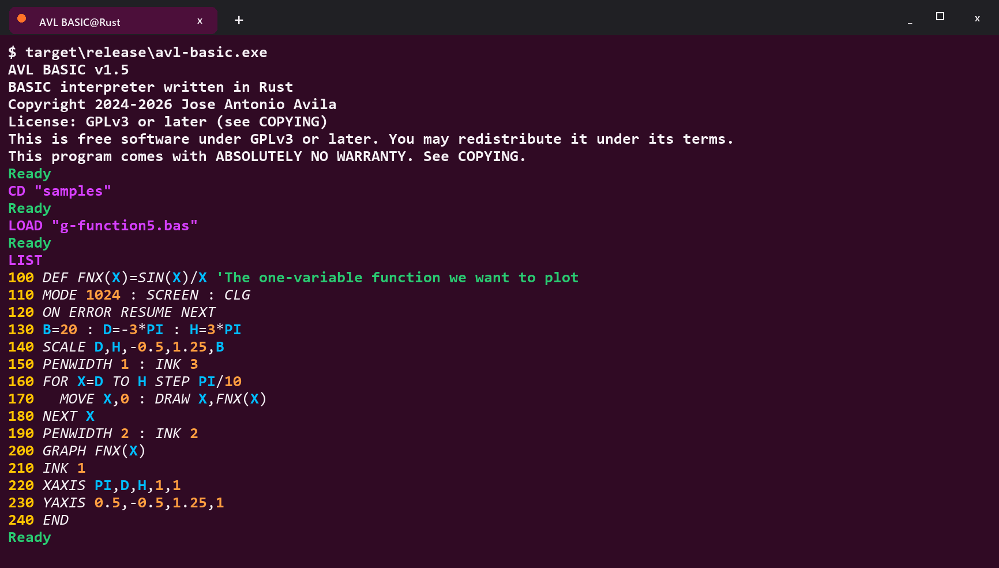

# AVL BASIC

<p align="center">
  
</p>

AVL BASIC is a classic-style BASIC system with line-numbered programs,
immediate mode, structured control flow, matrix operations, sprites, mouse and
keyboard input, and a complete built-in graphics environment.

The project now ships two implementations of the same language:

| Implementation | Location | Role | Quick run |
| --- | --- | --- | --- |
| Rust | [`rust/`](rust/) | Recommended native runtime. It is much faster and suitable for daily use and distribution. | `cd rust && cargo run --release` |
| Python | [`basic.py`](basic.py) | Reference implementation, compact educational interpreter, and compatibility oracle. | `python basic.py` |

Both implementations share the same manual, samples, language version, and
compatibility target. The Rust runtime is tested against the Python interpreter,
including text regressions and framebuffer-level graphics parity cases.

## Quick Start

Run the Rust interpreter:

```bash
cd rust
cargo run --release
```

Run a bundled sample with Rust:

```bash
cd rust
cargo run --release -- ../samples/g-cube2.bas
```

Run the Python reference implementation:

```bash
python basic.py
python basic.py samples/g-cube2.bas
```

From immediate mode, the bundled examples can be browsed like this:

```basic
CD "/"
CD "samples"
FILES "*.bas"
RUN "g-cube2.bas"
CD "/"
```

## Why It Is Interesting

AVL BASIC aims to preserve the immediacy of classic home-computer BASIC while
adding a practical modern feature set:

- plain `.bas` files and an interactive immediate mode,
- syntax-preserving program editing and listing,
- `ON ERROR`, `ON TIMER`, `ON MOUSE`, procedures, functions, and matrices,
- graphics commands for plotting, shapes, axes, sprites, screenshots, and input,
- deterministic examples and regressions used to keep both runtimes aligned.

The Python interpreter keeps the implementation easy to study. The Rust
interpreter keeps the same behavior but runs native and is typically much
faster, especially for graphics-heavy programs.

## Documentation

- Full manual in English: [`MANUAL.txt`](MANUAL.txt)
- Manual completo en español: [`MANUAL.es.txt`](MANUAL.es.txt)
- Rust implementation notes: [`rust/README.md`](rust/README.md)
- License: [`COPYING`](COPYING)

## Requirements

Rust implementation:

- Rust stable toolchain
- Native desktop environment for the graphics window

Python implementation:

- Python 3.8 or later
- Tkinter / Tk 8.6 or later

Tkinter is included in the official Python distributions for Windows and macOS.
On many Linux systems, install the `python3-tk` package separately.

## Project Layout

- [`basic.py`](basic.py): Python reference interpreter
- [`rust/`](rust/): Rust native interpreter and parity tools
- [`samples/`](samples/): shared BASIC example programs
- [`samples/assets/`](samples/assets/): shared image assets used by examples
- [`tests/`](tests/): Python regression tests
- [`MANUAL.txt`](MANUAL.txt), [`MANUAL.es.txt`](MANUAL.es.txt): shared language manuals

## License

AVL BASIC is free software released under the GNU GPL, version 3 or later.
