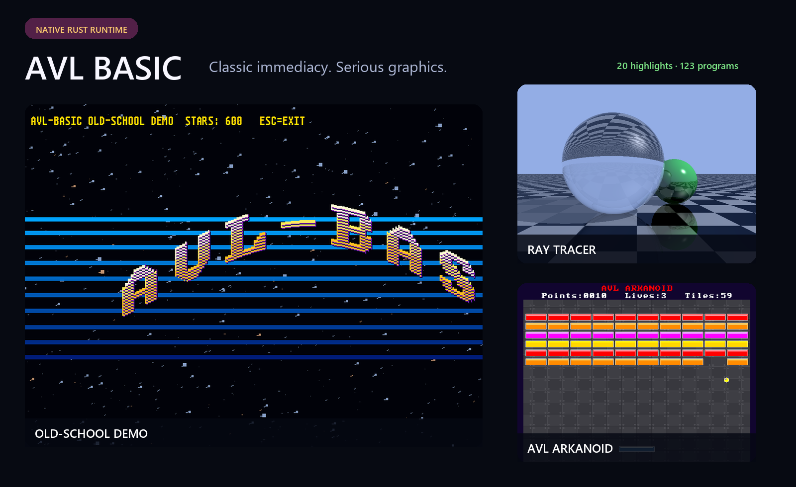
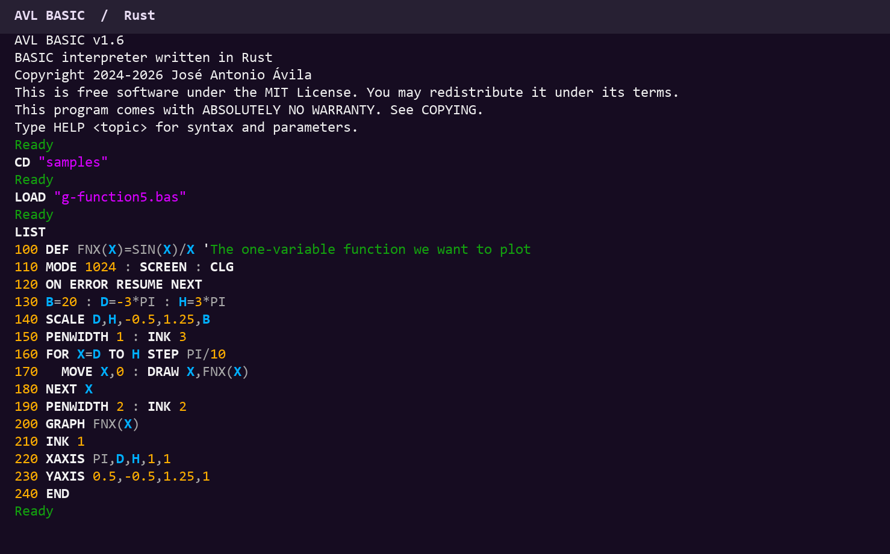

# AVL BASIC

<p align="center">
  
</p>

AVL BASIC is a native Rust implementation of a classic-style BASIC system with
line-numbered programs, immediate mode, an integrated full-screen editor and
visual debugger, structured control flow, matrix operations, sprites, mouse and
keyboard input, and a complete built-in graphics environment.

The project is built around the Rust runtime: a fast native executable for
daily use, packaged distribution, and source builds.

## Interactive by design

AVL BASIC keeps the classic immediate-mode workflow: change directory, load a
program, inspect it with `LIST`, and continue from the prompt.

`EDIT` opens the full-screen program editor. `DEBUG` opens the same source in a
read-only debugger and pauses before the first statement. It provides line
breakpoints, step into/over/out, and a live view of variables, arrays, the call
stack, errors, and timers, including the exact next statement and values
changed since the previous pause.

<p align="center">
  
</p>

## See What AVL BASIC Can Do

The hero above already shows the old-school demo, ray tracer, and Arkanoid.
Here are nine more complete BASIC programs running in the native interpreter,
not mockups or engine screenshots:

<table>
<tr>
<td width="33%" valign="top">
  <a href="samples/README.md#highlight-g-zoomer"></a><br>
  <strong>BASIC Zoomer</strong><br>
  Block-sampled texture mapping implemented directly in BASIC.
</td>
<td width="33%" valign="top">
  <a href="samples/README.md#highlight-g-origin"></a><br>
  <strong>Bouncing Viewport Cube</strong><br>
  A moving viewport clips and carries a rotating 3D scene.
</td>
<td width="33%" valign="top">
  <a href="samples/README.md#highlight-g-dot-tunnel"></a><br>
  <strong>Twisting Dot Tunnel</strong><br>
  Procedural 3D projection, depth motion, and a star backdrop.
</td>
</tr>
<tr>
<td width="33%" valign="top">
  <a href="samples/README.md#highlight-g-gouraud"></a><br>
  <strong>Gouraud Surface</strong><br>
  A software Z-buffer and per-vertex lighting, all in BASIC.
</td>
<td width="33%" valign="top">
  <a href="samples/README.md#highlight-g-fmandelbrot"></a><br>
  <strong>Mandelbrot Explorer</strong><br>
  Deep fractal detail rendered directly with AVL BASIC graphics.
</td>
<td width="33%" valign="top">
  <a href="samples/README.md#highlight-g-cube-tquad"></a><br>
  <strong>Textured Cube</strong><br>
  Projection, hidden-face removal, and affine textured quads.
</td>
</tr>
<tr>
<td width="33%" valign="top">
  <a href="samples/README.md#highlight-g-chess960"></a><br>
  <strong>Chess960 Generator</strong><br>
  Legal randomized positions, constraints, and sprite rendering.
</td>
<td width="33%" valign="top">
  <a href="samples/README.md#highlight-g-maze"></a><br>
  <strong>Maze Generator</strong><br>
  Procedural generation with its solution drawn through the maze.
</td>
<td width="33%" valign="top">
  <a href="samples/README.md#highlight-g-origin-scale"></a><br>
  <strong>Four-Panel Plot Gallery</strong><br>
  Independent viewports combine plots, data, axes, and fractals.
</td>
</tr>
</table>

**[Explore all 20 visual highlights and the complete 115-program catalog →](samples/README.md)**

## Download

For Windows users, the easiest option is the prebuilt native package:

1. Download the latest `avl-basic-*-windows-x64.zip` from
   [GitHub Releases](https://github.com/dobleproblema/AVL-BASIC/releases/latest).
2. Extract the ZIP.
3. Run `avl-basic.exe`.

The Windows package includes the native interpreter, manuals, examples, assets,
and license. You do not need Rust or Cargo to use it.

Linux and macOS users can build from source until prebuilt packages are
published for those platforms.

## Quick Start

With the Windows package:

```bat
avl-basic.exe
avl-basic.exe samples\g-old-school.bas
```

From BASIC immediate mode:

```basic
HELP RIGHT$
TOUR
SAMPLES
RUN "/samples/g-old-school.bas"
```

`HELP topic` gives a compact syntax and parameter reminder. `TOUR` explains
the 20 highlights and the techniques behind them. `SAMPLES` lists all 115
bundled programs by category. `HELP`, `TOUR`, and `SAMPLES` are read-only: they
do not replace the program in memory or run anything automatically.

## Build From Source

Requirements:

- Rust stable toolchain
- A native desktop environment for the graphics window

Build the release interpreter:

```bash
cargo build --release
```

Run interactive mode:

```bash
cargo run --release
```

Run a bundled sample:

```bash
cargo run --release -- samples/g-old-school.bas
```

The compiled executable is created at:

- Windows: `target/release/avl-basic.exe`
- Linux/macOS: `target/release/avl-basic`

On Linux, the application icon is embedded in the executable and assigned to
the graphics window under X11. A standalone ELF executable still has the
generic executable icon in file managers, as is normal on Linux. To install
the compiled interpreter, standard `hicolor` application icons, and an AVL
BASIC launcher in your user desktop menu, run:

```bash
sh packaging/install_linux_desktop.sh
```

The script uses `target/release/avl-basic` by default. You may pass another
compiled executable as its first argument. It installs the binary under
`~/.local/bin`, and the samples and visual catalog under
`${XDG_DATA_HOME:-~/.local/share}/avl-basic`, without requiring root
permissions. The desktop launcher starts in that data directory, so `TOUR`,
`SAMPLES`, and their `/samples/...` commands work immediately. The launcher
opens a terminal because AVL BASIC remains a console-first interpreter.

For source builds, `cargo build` creates a `target/release/samples` directory
link to the repository examples. If your working directory is `target/release`,
`CD "samples"` works by normal path resolution.

## Why It Is Interesting

AVL BASIC aims to preserve the immediacy of classic home-computer BASIC while
adding a practical modern feature set:

- plain `.bas` files and an interactive immediate mode,
- a compact built-in `HELP topic` syntax and parameter reference,
- syntax-preserving program editing and listing, plus a separate read-only debugger,
- `ON ERROR`, `ON TIMER`, `ON MOUSE`, procedures, functions, and matrices,
- graphics commands for plotting, shapes, axes, sprites, screenshots, and input,
- embedded bitmap fonts for reproducible graphics text,
- deterministic examples and regression tests for the native runtime,
- a built-in `TOUR` and categorized `SAMPLES` catalog for discovering what is
  already included.

The interpreter is console-first and line-numbered by design. It is meant to
feel direct and teachable rather than like an IDE-centered dialect.

## Embedded Fonts

AVL BASIC embeds its own small and large bitmap fonts in the Rust binary. The
editable source is [`assets/fonts/avl-basic-fonts.txt`](assets/fonts/avl-basic-fonts.txt).
`build.rs` validates that source and generates the Rust glyph tables during the
build.

## Documentation

- Full manual in English: [`MANUAL.txt`](MANUAL.txt)
- Manual completo en español: [`MANUAL.es.txt`](MANUAL.es.txt)
- Visual tour and complete sample catalog: [`samples/README.md`](samples/README.md)
- License: [`COPYING`](COPYING)

## Project Layout

- [`src/`](src/): interpreter, parser helpers, graphics, console, and window backend
- [`tests/`](tests/): Rust unit and integration tests
- [`tools/`](tools/): maintainer validation and benchmark tools
- [`samples/`](samples/): 115 BASIC programs and their browsable catalog
- [`samples/showcase/`](samples/showcase/): reproducible runtime captures
- [`samples/assets/`](samples/assets/): image assets used by examples
- [`assets/fonts/`](assets/fonts/): editable embedded bitmap font source
- [`packaging/`](packaging/): release packaging scripts

## Release Packaging

The generated `release/` directory is local build output. Published binaries
belong in GitHub Releases, not in the Git repository.

## License

AVL BASIC is free software released under the GNU GPL, version 3 or later.
