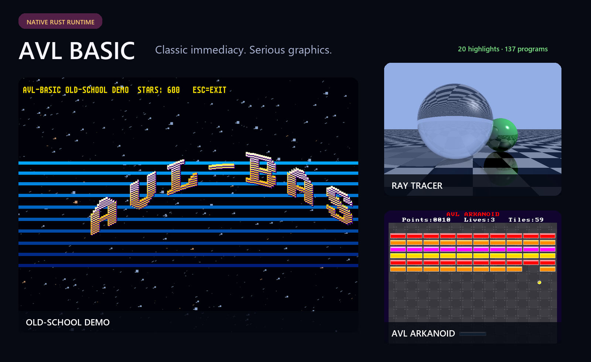
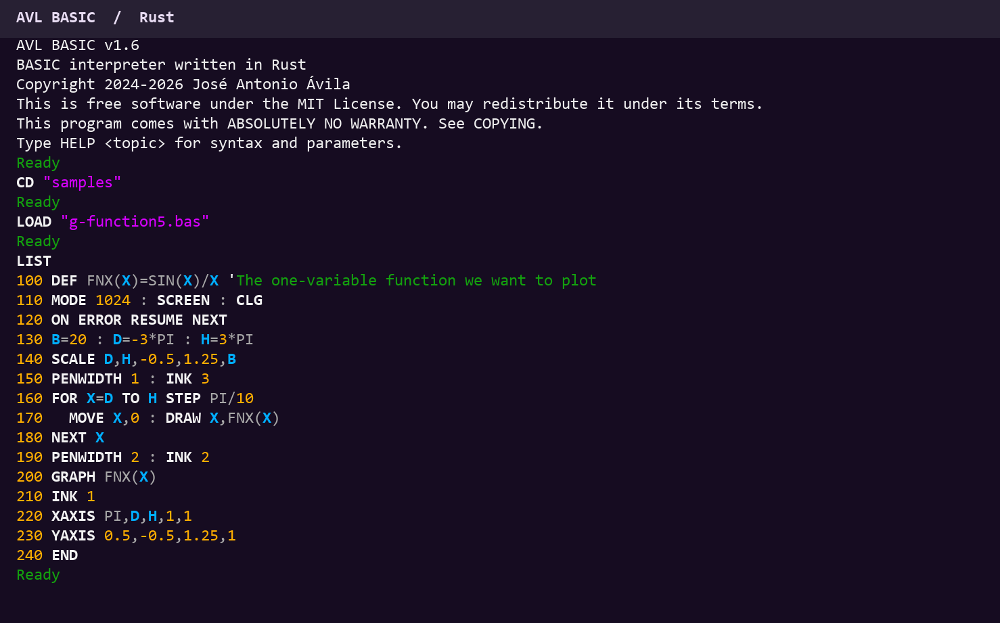
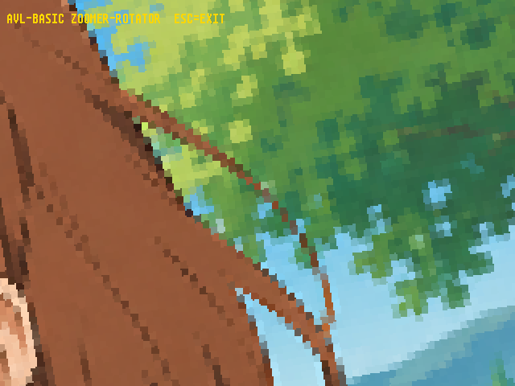
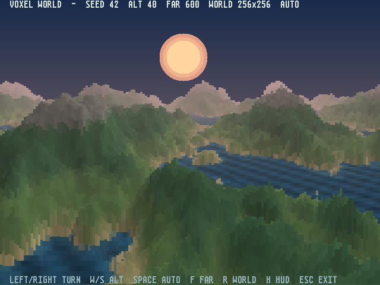
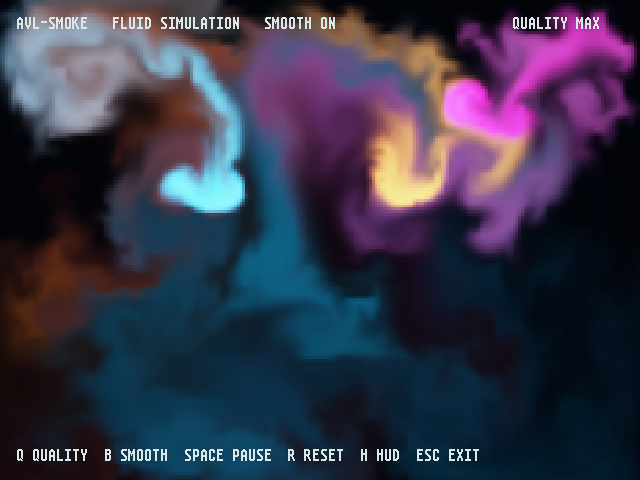
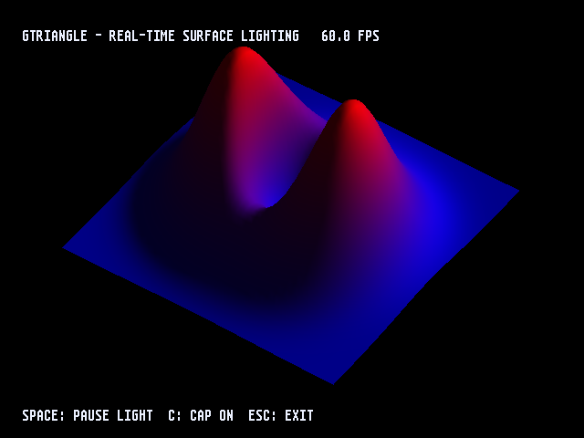
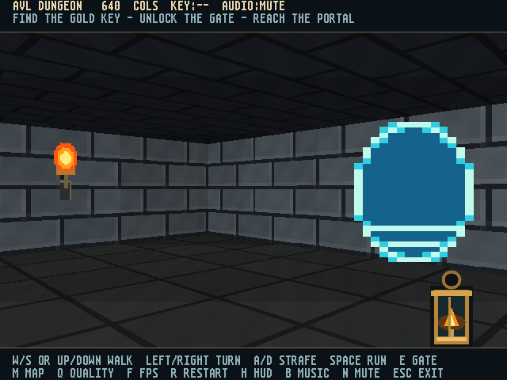
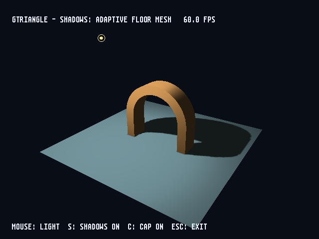
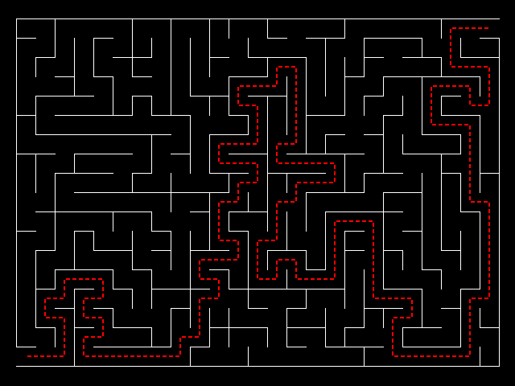
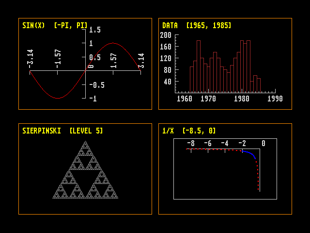

# AVL BASIC

<p align="center">
  
</p>

AVL BASIC is a native Rust implementation of a classic-style BASIC system with
line-numbered programs, immediate mode, an integrated full-screen editor and
debugger, structured control flow, matrix operations, sequential data files,
sprites, mouse and keyboard input, a complete built-in graphics environment
with Gouraud shading and depth testing, CPC-style sound synthesis, and modern
audio playback.

The project is built around the Rust runtime: a fast native executable for
daily use, packaged distribution, and source builds.

Save scores, settings and reports with `OPEN`, `PRINT #`, `WRITE #`, `INPUT #`,
`LINE INPUT #`, `EOF` and `CLOSE`. Sequential files use UTF-8 and support both
plain text and recoverable CSV records. Start with the compact examples for
[scores](samples/f-scores.bas), [text and append](samples/f-text.bas), and
[CSV records](samples/f-records.bas); manual section 5.2 defines the syntax.

`IIF(condition,true-expression,false-expression)` selects a numeric or string
result. It requires all three arguments, evaluates the condition once, and
evaluates only the chosen branch. See [the IIF example](samples/iif.bas).

## Interactive by design

AVL BASIC keeps the classic immediate-mode workflow: change directory, load a
program, inspect it with `LIST`, and continue from the prompt.

`EDIT` opens the full-screen program editor. `DEBUG` opens the same source in a
full-screen debugger and pauses before the first statement. It provides line
breakpoints, step into/over/out, and a live view of variables, arrays, the call
stack, errors, and timers, including the exact next statement and values
changed since the previous pause. Inspector categories can be collapsed, and
scalars and arrays can be pinned for focused tracking, entirely from the keyboard.
Each pinned array follows its last-written element. Press Enter on an inspector
value to edit a scalar or the displayed array element in place, without resuming
execution. In the code panel, F3 sets the next complete statement within a compatible
execution context; F9 restarts from the beginning while retaining breakpoints and
inspector preferences. The BASIC source remains read-only while debugging.

<p align="center">
  
</p>

## See What AVL BASIC Can Do

The hero above already shows the old-school demo, ray tracer, and Arkanoid.
Here are nine more complete BASIC programs running in the native interpreter,
not mockups or engine screenshots:

<table>
<tr>
<td width="33%" valign="top">
  <a href="samples/README.md#highlight-g-zoomer"></a><br>
  <strong>BASIC Zoomer</strong><br>
  Block-sampled texture mapping implemented directly in BASIC.
</td>
<td width="33%" valign="top">
  <a href="samples/README.md#highlight-g-voxel"></a><br>
  <strong>Voxel World</strong><br>
  Fly over procedural terrain with filtered lighting and fog.
</td>
<td width="33%" valign="top">
  <a href="samples/README.md#highlight-g-smoke"></a><br>
  <strong>Smoke Simulation</strong><br>
  Swirling dye driven by pressure projection and vorticity.
</td>
</tr>
<tr>
<td width="33%" valign="top">
  <a href="samples/README.md#highlight-g-animation2"></a><br>
  <strong>Real-Time Moving Light</strong><br>
  A rotating light shades a procedural surface in real time.
</td>
<td width="33%" valign="top">
  <a href="samples/README.md#highlight-g-fmandelbrot"></a><br>
  <strong>Mandelbrot Explorer</strong><br>
  Deep fractal detail rendered directly with AVL BASIC graphics.
</td>
<td width="33%" valign="top">
  <a href="samples/README.md#highlight-g-dungeon"></a><br>
  <strong>AVL Dungeon</strong><br>
  Find the key and escape a textured maze with original audio.
</td>
</tr>
<tr>
<td width="33%" valign="top">
  <a href="samples/README.md#highlight-g-shadow-adaptive"></a><br>
  <strong>Arch Shadows</strong><br>
  Move the light with the mouse and watch the arch cast shadows across the floor.
</td>
<td width="33%" valign="top">
  <a href="samples/README.md#highlight-g-maze"></a><br>
  <strong>Maze Generator</strong><br>
  Procedural generation with its solution drawn through the maze.
</td>
<td width="33%" valign="top">
  <a href="samples/README.md#highlight-g-origin-scale"></a><br>
  <strong>Four-Panel Plot Gallery</strong><br>
  Independent viewports combine plots, data, axes, and fractals.
</td>
</tr>
</table>

**[Explore all 20 visual highlights and the complete 137-program catalog →](samples/README.md)**

## Download

For Windows users, the easiest option is the prebuilt native package:

1. Download the latest `avl-basic-*-windows-x64.zip` from
   [GitHub Releases](https://github.com/dobleproblema/AVL-BASIC/releases/latest).
2. Extract the ZIP.
3. Run `avl-basic.exe`.

The Windows package includes the native interpreter, manuals, examples, assets,
and license. You do not need Rust or Cargo to use it.

Linux x86-64 users can download `avl-basic-*-linux-x64.tar.gz` from the same
release page, extract it, and run `./avl-basic` from a terminal. The prebuilt
binary requires glibc 2.39 or later and `libasound.so.2`; graphics use X11 or
XWayland. See `README-FIRST.txt` in the package for details. Older Linux
distributions and macOS users can build from source.

## Sound and Music

Use `SOUND`, `ENV`, `ENT`, `RELEASE`, `SQ` and `ON SQ` for three-channel
Amstrad CPC-style music, or `AUDIO` to load and play WAV, MP3, Ogg Vorbis and
FLAC with independent playback channels, volume, stereo pan, playback rate
and fades. `BEEP` now plays a short synthesized tone.

`END` and normal program completion leave pending sound playing while the
interpreter returns to `Ready`. Press `Ctrl+C` at the prompt to stop all
pending notes and sample voices; with no pending audio it exits the interpreter.
Direct command-line execution waits for audio to finish before exiting,
with `Ctrl+C` available to cancel it.

Try the [Old-School Demo with original looping music](samples/g-old-school.bas),
the [CPC manual duet](samples/s-cpc-duet.bas), the
[playback controls example](samples/s-audio.bas), or
[Arkanoid with sound effects](samples/g-arkanoid.bas). The required audio
files are included in both desktop packages.

## Quick Start

With the Windows package:

```bat
avl-basic.exe
avl-basic.exe samples\g-old-school.bas
```

From BASIC immediate mode:

```basic
HELP RIGHT$
RUN "samples/g-old-school.bas"
```

`HELP topic` gives a compact syntax and parameter reminder. Its complete
catalog is compiled into the executable: the interpreter never needs the
source catalog, this README, the manuals, or the sample tree at runtime. The
137 sample programs and their visual gallery are optional companion material.

## Build From Source

Requirements:

- Rust 1.99.0 (selected by `rust-toolchain.toml` on every platform)
- A native desktop environment for the graphics window

Use rustup so the repository selects the same compiler on Windows and Linux/WSL.
If this directory has an older local override, remove it with
`rustup override unset` and check the selected version with `rustc --version`.

Build the release interpreter:

```bash
cargo build --release
```

Audio uses Kira and CPAL, with built-in decoding for WAV PCM, MP3, Ogg Vorbis,
and FLAC. On Linux, building also requires `pkg-config` and the ALSA development
package (`libasound2-dev` on Debian/Ubuntu); the executable requires
`libasound.so.2` at startup. No external player or codec pack is needed.
If an output device cannot be opened, audio commands retain their timing in
silence. `AVL_BASIC_AUDIO=off` starts with output disabled.
WSLg uses a small Rust adapter for its PulseAudio server, with bounded buffers
and a connection that can be interrupted. It uses the existing `pulseaudio`
protocol crate and needs no additional native library. Third-party notices
are collected in `LICENSES`. Audio output is released when playback finishes
or is cancelled; later playback retries it if necessary. An unresponsive
output is detected so CPC sound queues can continue silently.

The sound examples are `samples/s-melody.bas` (CPC-style envelopes),
`samples/s-queue.bas` (`ON SQ`), and `samples/s-audio.bas` (sample playback).

Run interactive mode:

```bash
cargo run --release
```

Run a bundled sample:

```bash
cargo run --release -- samples/g-old-school.bas
```

The compiled executable is created at:

- Windows: `target/release/avl-basic.exe`
- Linux/macOS: `target/release/avl-basic`

On Linux, the application icon is embedded in the executable and assigned to
the graphics window under X11. A standalone ELF executable still has the
generic executable icon in file managers, as is normal on Linux. To install
the compiled interpreter, standard `hicolor` application icons, and an AVL
BASIC launcher in your user desktop menu, run:

```bash
sh packaging/install_linux_desktop.sh
```

The script uses `target/release/avl-basic` by default. You may pass another
compiled executable as its first argument. It installs the binary under
`~/.local/bin`, and the samples and visual catalog under
`${XDG_DATA_HOME:-~/.local/share}/avl-basic`, without requiring root
permissions. The desktop launcher starts in that data directory so the
installed examples can be loaded by their normal paths. The launcher opens a
terminal because AVL BASIC remains a console-first interpreter.

## Why It Is Interesting

AVL BASIC aims to preserve the immediacy of classic home-computer BASIC while
adding a practical modern feature set:

- plain `.bas` files and an interactive immediate mode,
- a compact built-in `HELP topic` syntax and parameter reference,
- syntax-preserving program editing and listing, plus a separate full-screen debugger,
- `ON ERROR`, `AFTER`/`EVERY`, `ON MOUSE`, procedures, functions, and matrices,
- graphics commands for plotting, shapes, axes, sprites, screenshots, and input,
- triangles with interpolated RGB and a depth buffer stored in a BASIC array,
- CPC-style sound queues and envelopes, plus modern audio playback controls,
- embedded bitmap fonts for reproducible graphics text,
- deterministic examples and regression tests for the native runtime,
- a visual gallery and categorized sample catalog on GitHub for discovering
  what is already included.

The interpreter is console-first and line-numbered by design. It is meant to
feel direct and teachable rather than like an IDE-centered dialect.

## Embedded Runtime Data

AVL BASIC embeds its own small and large bitmap fonts in the Rust binary. The
editable source is [`assets/fonts/avl-basic-fonts.txt`](assets/fonts/avl-basic-fonts.txt).
`build.rs` validates that source and generates the Rust glyph tables during the
build. It similarly validates [`src/language/catalog.tsv`](src/language/catalog.tsv)
and turns its language topics, contexts, highlighting classes, and error codes
into static Rust tables. Both catalogs are therefore part of the executable,
not runtime files.

## Documentation

Release packages include offline HTML manuals in English and Spanish. Open
`MANUAL.html` for English or `MANUAL.es.html` for Spanish, beside the executable.
The examples use AVL BASIC's syntax highlighting
on a black background and can be copied into the interpreter.

To try a complete program, start the interpreter in the extracted package
folder, enter `NEW` and `CD "/"`, paste the example, and enter `RUN`. Image and
audio examples use the included `samples/assets` directory. If you save a copied
example, save it in that same package folder so its relative asset paths still
resolve.

The TXT sources remain in the repository; end-user packages include only the
two HTML manuals. The HTML manuals work without a web server or an internet
connection.

- English manual source: [`MANUAL.txt`](https://github.com/dobleproblema/AVL-BASIC/blob/main/MANUAL.txt)
- Fuente del manual en español: [`MANUAL.es.txt`](https://github.com/dobleproblema/AVL-BASIC/blob/main/MANUAL.es.txt)
- Visual gallery and complete sample catalog: [`samples/README.md`](samples/README.md)
- License: MIT. See [`COPYING`](COPYING).

## Project Layout

- [`src/`](src/): interpreter, parser helpers, graphics, console, and window backend
- [`tests/`](tests/): Rust unit and integration tests
- [`samples/`](samples/): 137 BASIC programs and their browsable catalog
- [`samples/showcase/`](samples/showcase/): runtime captures of the examples
- [`samples/assets/`](samples/assets/): image and audio assets used by examples
- [`assets/fonts/`](assets/fonts/): editable embedded bitmap font source
- [`src/language/catalog.tsv`](src/language/catalog.tsv): declarative language and error catalog
- [`packaging/`](packaging/): release packaging scripts

## Release Packaging

After validation, run `python packaging/package_windows_release.py --skip-build`
for Windows, or `python3 packaging/package_linux_release.py --skip-build` on
Linux/WSL. Both packages include the HTML manuals, the complete sample tree
and license notices. The Linux archive
preserves executable permissions and records the
binary's minimum glibc version.

Unpacked staging directories and raw executables are local build output.
Versioned Windows ZIPs are retained in Git as in earlier releases; downloadable
Windows and Linux packages are published in GitHub Releases.

## License

AVL BASIC is free software released under the MIT License. See [`COPYING`](COPYING).

The licenses and copyright notices for third-party dependencies are collected
in [`LICENSES`](LICENSES), included in both
desktop packages alongside [`COPYING`](COPYING).
