# AVL BASIC sample gallery

AVL BASIC ships with **115 runnable programs**. They are not filler or API
snippets: the collection includes complete visual pieces, playable programs,
numerical algorithms, interactive explorers, and focused teaching examples.

For the richest offline view, open [`samples/index.html`](index.html) in any
modern browser. It needs no web server and keeps all 20 highlights and the
complete catalog on one responsive page.

From the interpreter, type:

```basic
TOUR
SAMPLES
RUN "/samples/g-old-school.bas"
```

`TOUR` presents the 20 highlights below. `SAMPLES` lists
the entire catalog. Neither command changes the current program or runs
anything automatically.

## Start here

<a id="highlight-g-old-school"></a>
<p align="center">
  <a href="g-old-school.bas">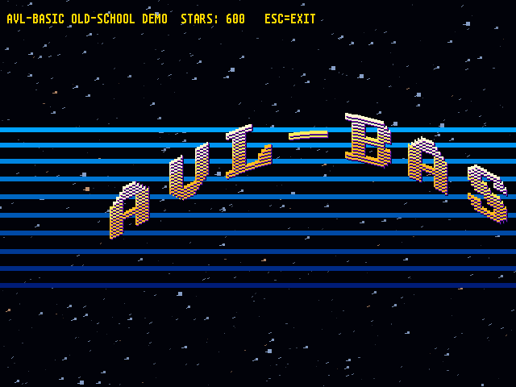</a>
</p>
<p align="center">
  <strong>1. Old-School Demo</strong><br>
  A complete demoscene postcard: 3D starfield, copper bars and a hand-built sine scroller.<br>
  <sub><strong>Shows:</strong> 3D starfield · SPRITE$ · sine scroller</sub><br>
  <code>RUN "/samples/g-old-school.bas"</code>
</p>

<table>
<tr>
<td width="50%" valign="top">
  <a id="highlight-g-raytracer"></a>
  <a href="g-raytracer.bas">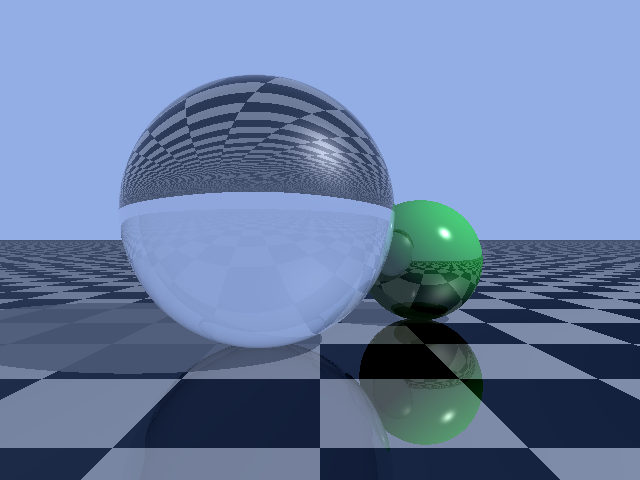</a><br>
  <strong>2. Ray Tracer</strong><br>
  A 640×480 glass-and-mirrors scene ray-traced entirely in BASIC.<br>
  <sub><strong>Shows:</strong> ray tracing · Fresnel · reflection and refraction</sub><br>
  <code>RUN "/samples/g-raytracer.bas"</code>
</td>
<td width="50%" valign="top">
  <a id="highlight-g-arkanoid"></a>
  <a href="g-arkanoid.bas">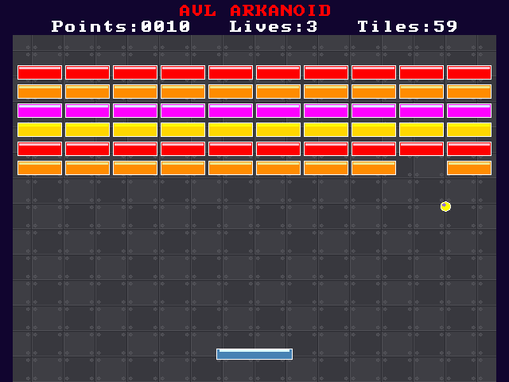</a><br>
  <strong>3. AVL Arkanoid</strong><br>
  A genuinely playable brick-breaker—and a collision-engine masterclass.<br>
  <sub><strong>Shows:</strong> sprite collisions · color collisions · mouse input</sub><br>
  <code>RUN "/samples/g-arkanoid.bas"</code>
</td>
</tr>
<tr>
<td width="50%" valign="top">
  <a id="highlight-g-bigbang"></a>
  <a href="g-bigbang.bas">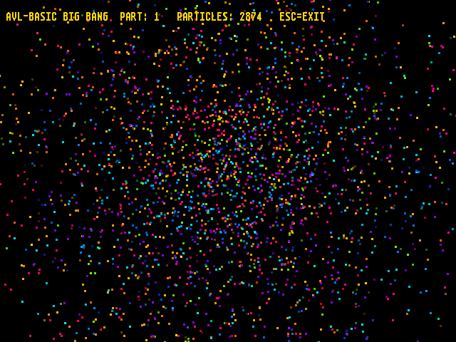</a><br>
  <strong>4. Big Bang</strong><br>
  Thousands of pixels explode into particles and reassemble as a second image.<br>
  <sub><strong>Shows:</strong> BLOAD · TEST · particle morphing</sub><br>
  <code>RUN "/samples/g-bigbang.bas"</code>
</td>
<td width="50%" valign="top">
  <a id="highlight-g-zoomer"></a>
  <a href="g-zoomer.bas">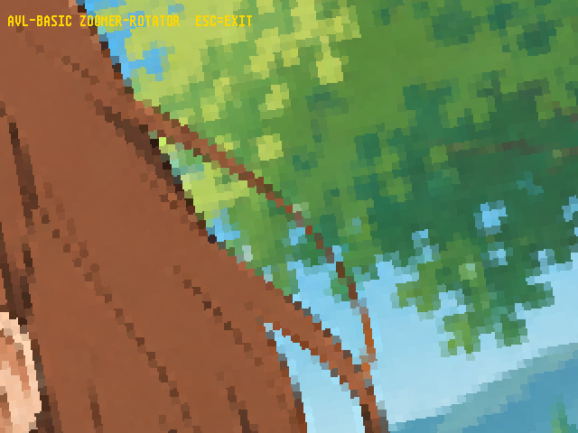</a><br>
  <strong>5. BASIC Zoomer</strong><br>
  Block-sampled texture mapping powers a retro zoomer.<br>
  <sub><strong>Shows:</strong> BLOAD · TEST · block rendering</sub><br>
  <code>RUN "/samples/g-zoomer.bas"</code>
</td>
</tr>
<tr>
<td width="50%" valign="top">
  <a id="highlight-g-cube-tquad"></a>
  <a href="g-cube-tquad.bas">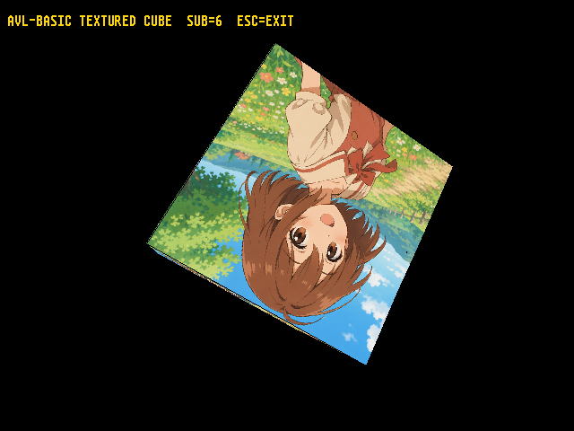</a><br>
  <strong>6. Textured Cube</strong><br>
  A spinning textured cube built from projection math and affine quads.<br>
  <sub><strong>Shows:</strong> 3D projection · back-face culling · TQUAD</sub><br>
  <code>RUN "/samples/g-cube-tquad.bas"</code>
</td>
<td width="50%" valign="top">
  <a id="highlight-g-gouraud"></a>
  <a href="g-gouraud.bas">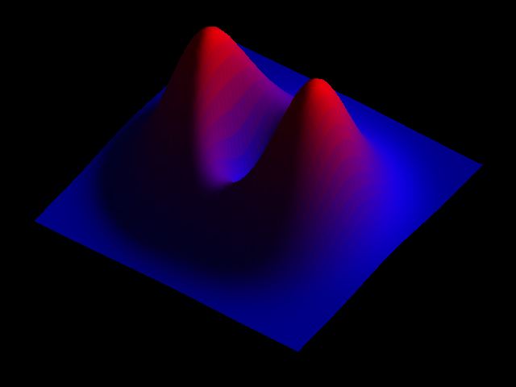</a><br>
  <strong>7. Gouraud Surface</strong><br>
  A mathematical surface rendered with a software Z-buffer and per-vertex lighting.<br>
  <sub><strong>Shows:</strong> Z-buffer · barycentric rasterization · vertex lighting</sub><br>
  <code>RUN "/samples/g-gouraud.bas"</code>
</td>
</tr>
<tr>
<td width="50%" valign="top">
  <a id="highlight-g-origin"></a>
  <a href="g-origin.bas">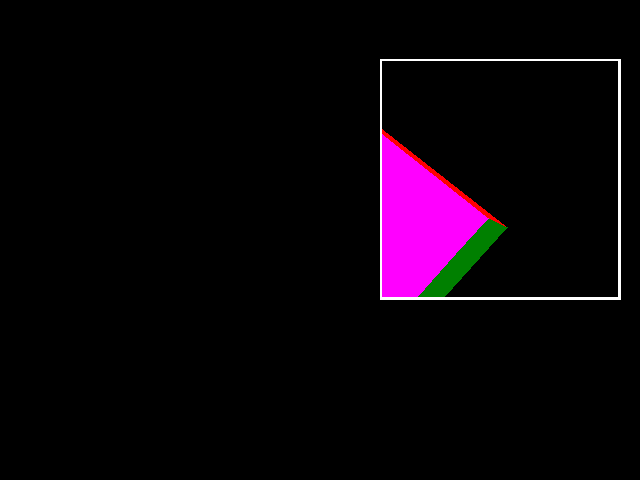</a><br>
  <strong>8. Bouncing Viewport Cube</strong><br>
  Rotating cube moves inside a bouncing viewport.<br>
  <sub><strong>Shows:</strong> ORIGIN · 3D projection · viewport animation</sub><br>
  <code>RUN "/samples/g-origin.bas"</code>
</td>
<td width="50%" valign="top">
  <a id="highlight-g-dot-tunnel"></a>
  <a href="g-dot-tunnel.bas">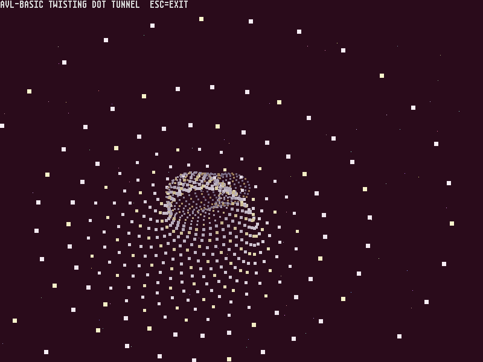</a><br>
  <strong>9. Twisting Dot Tunnel</strong><br>
  Twisting 3D dot tunnel with star backdrop.<br>
  <sub><strong>Shows:</strong> 3D projection · procedural animation · FRAME</sub><br>
  <code>RUN "/samples/g-dot-tunnel.bas"</code>
</td>
</tr>
<tr>
<td width="50%" valign="top">
  <a id="highlight-g-fmandelbrot"></a>
  <a href="g-fmandelbrot.bas">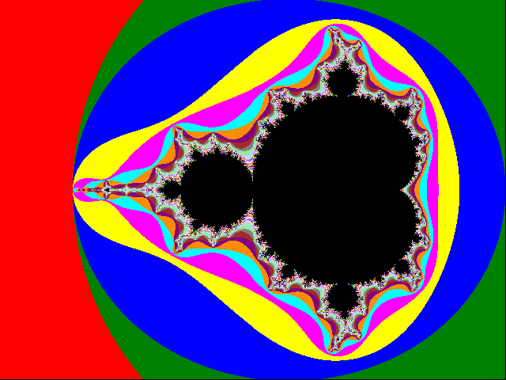</a><br>
  <strong>10. Mandelbrot Explorer</strong><br>
  Click into the Mandelbrot set and dive deeper with every redraw.<br>
  <sub><strong>Shows:</strong> complex iteration · mouse zoom · SCALE</sub><br>
  <code>RUN "/samples/g-fmandelbrot.bas"</code>
</td>
<td width="50%" valign="top">
  <a id="highlight-g-chess960"></a>
  <a href="g-chess960.bas">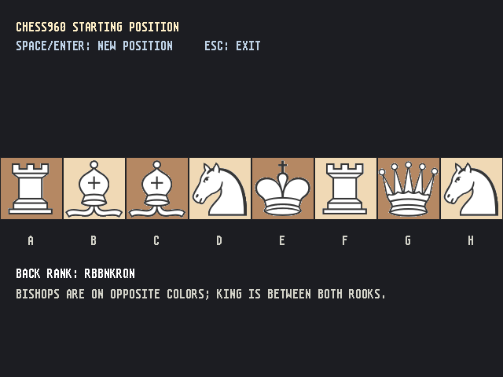</a><br>
  <strong>11. Chess960 Generator</strong><br>
  Generate legal Chess960 back ranks, rendered with real pieces and one-key rerolls.<br>
  <sub><strong>Shows:</strong> DEF SUB · constrained randomization · sprites</sub><br>
  <code>RUN "/samples/g-chess960.bas"</code>
</td>
</tr>
<tr>
<td width="50%" valign="top">
  <a id="highlight-g-maze"></a>
  <a href="g-maze.bas">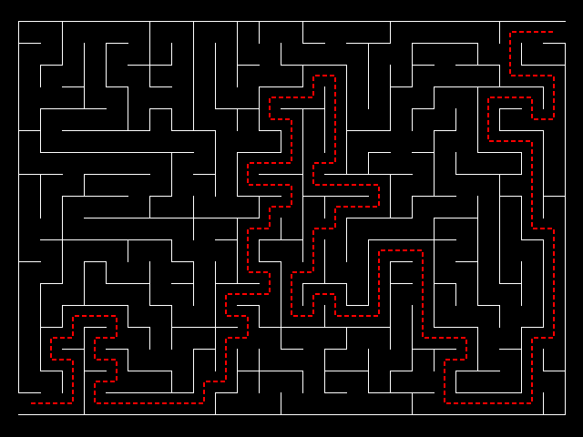</a><br>
  <strong>12. Maze Generator</strong><br>
  A fresh maze appears with its solution stitched through it in a dashed path.<br>
  <sub><strong>Shows:</strong> DFS/Prim · bit masks · path reconstruction</sub><br>
  <code>RUN "/samples/g-maze.bas"</code>
</td>
<td width="50%" valign="top">
  <a id="highlight-g-jelly"></a>
  <a href="g-jelly.bas">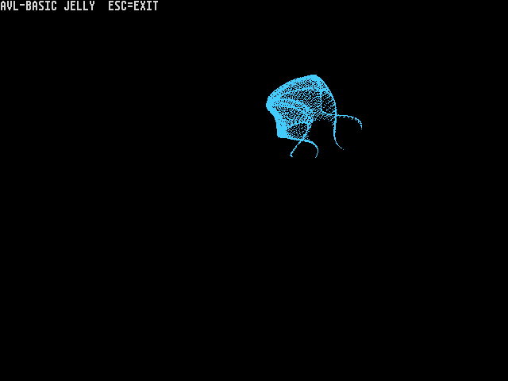</a><br>
  <strong>13. Jelly</strong><br>
  Ten thousand points fold into a living neon form.<br>
  <sub><strong>Shows:</strong> parametric plotting · offscreen rendering · FRAME</sub><br>
  <code>RUN "/samples/g-jelly.bas"</code>
</td>
</tr>
<tr>
<td width="50%" valign="top">
  <a id="highlight-g-balls"></a>
  <a href="g-balls.bas">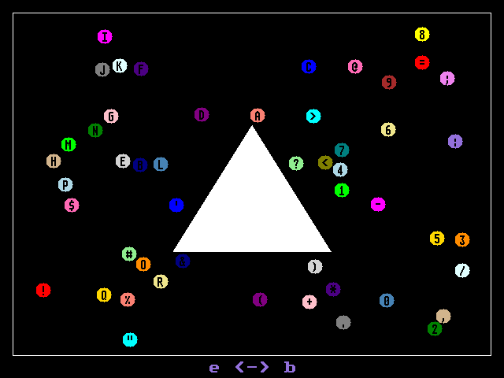</a><br>
  <strong>14. Colliding Balls</strong><br>
  Fifty numbered sprites bounce and collide without full clears.<br>
  <sub><strong>Shows:</strong> sprite collisions · dirty redraw · COLMODE</sub><br>
  <code>RUN "/samples/g-balls.bas"</code>
</td>
<td width="50%" valign="top">
  <a id="highlight-g-ftree4"></a>
  <a href="g-ftree4.bas">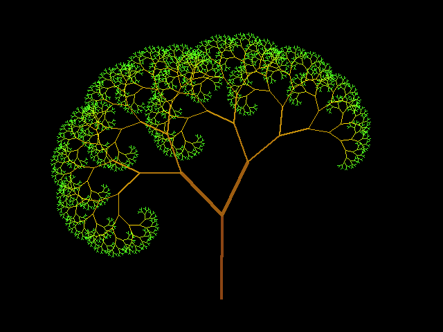</a><br>
  <strong>15. Animated Tree</strong><br>
  Animated swaying tree redraws recursive branches each frame.<br>
  <sub><strong>Shows:</strong> simulated recursion · EVERY · offscreen rendering</sub><br>
  <code>RUN "/samples/g-ftree4.bas"</code>
</td>
</tr>
<tr>
<td width="50%" valign="top">
  <a id="highlight-g-origin-scale"></a>
  <a href="g-origin-scale.bas">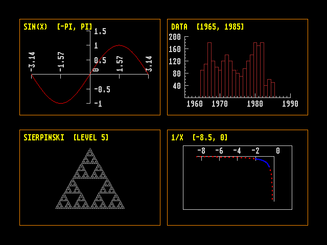</a><br>
  <strong>16. Four-Panel Plot Gallery</strong><br>
  Four independent mathematical canvases share one screen: plots, data, axes and fractals.<br>
  <sub><strong>Shows:</strong> DEF SUB · ORIGIN and SCALE · GRAPHRANGE</sub><br>
  <code>RUN "/samples/g-origin-scale.bas"</code>
</td>
<td width="50%" valign="top">
  <a id="highlight-g-bifurcation"></a>
  <a href="g-bifurcation.bas">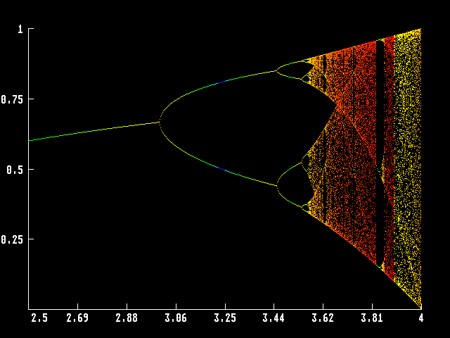</a><br>
  <strong>17. Bifurcation Explorer</strong><br>
  Explore chaos by clicking into a rainbow logistic-map bifurcation diagram.<br>
  <sub><strong>Shows:</strong> logistic map · Lyapunov exponent · mouse zoom</sub><br>
  <code>RUN "/samples/g-bifurcation.bas"</code>
</td>
</tr>
<tr>
<td width="50%" valign="top">
  <a id="highlight-g-loan"></a>
  <a href="g-loan.bas">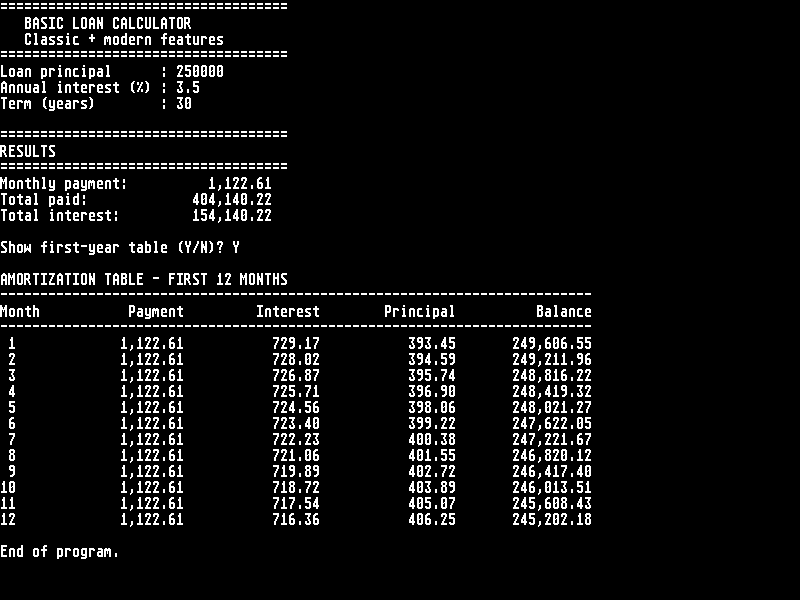</a><br>
  <strong>18. Graphical Loan Calculator</strong><br>
  Graphical loan calculator with optional amortization table.<br>
  <sub><strong>Shows:</strong> GINPUT · DEF FN · formatted output</sub><br>
  <code>RUN "/samples/g-loan.bas"</code>
</td>
<td width="50%" valign="top">
  <a id="highlight-g-tunnel-tquad"></a>
  <a href="g-tunnel-tquad.bas">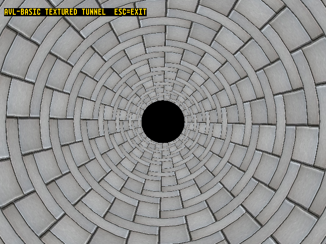</a><br>
  <strong>19. Textured Tunnel</strong><br>
  A seamless textured tunnel turns a ring mesh into a fluid animated ride.<br>
  <sub><strong>Shows:</strong> TQUAD · mesh generation · texture animation</sub><br>
  <code>RUN "/samples/g-tunnel-tquad.bas"</code>
</td>
</tr>
<tr>
<td width="50%" valign="top">
  <a id="highlight-pimachin-modern"></a>
  <a href="pimachin-modern.bas">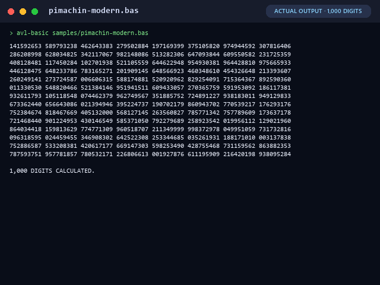</a><br>
  <strong>20. Modern Machin Pi</strong><br>
  Compute 1,000 digits of π with block arithmetic and structured, modern BASIC.<br>
  <sub><strong>Shows:</strong> DEF SUB · LOCAL · arbitrary precision</sub><br>
  <code>RUN "/samples/pimachin-modern.bas"</code>
</td>
<td width="50%"></td>
</tr>
</table>

Every image above was captured from the real Rust runtime. The capture tool
uses temporary instrumented copies, so the original BASIC programs remain
untouched:

```console
python tools/generate_showcase.py
```

## Suggested learning routes

- **From wireframes to texture mapping:** `g-cube2.bas` → `g-cube-tquad.bas`.
- **Build a texture mapper, then use the native primitive:** `g-zoomer.bas` →
  `g-zoomer-tquad.bas`.
- **From flat to interpolated light:** `g-lambert.bas` → `g-gouraud.bas`.
- **Build a demoscene effect:** `g-starfield.bas` + `g-sine-scroll.bas` →
  `g-old-school.bas`.
- **Compare two tunnel engines:** `g-tunnel.bas` → `g-tunnel-tquad.bas`.
- **Learn collisions, then build a game:** `g-balls.bas` + `g-sprite5.bas` →
  `g-arkanoid.bas`.
- **Modernize a classic algorithm:** `pimachin.bas` → `pimachin-modern.bas`.

## Full catalog — 115 programs

The catalog separates polished pieces from small, purposeful probes. That
makes the latter easier to find without pretending every test is a headline
demo.

### Showcase animations and retro effects (17)

| Sample | What it demonstrates | Techniques |
|---|---|---|
| <a id="sample-g-bernoulli"></a>[`g-bernoulli.bas`](g-bernoulli.bas) | Animated five-lobed radial point curve. | PLOT, ORIGIN, FRAME |
| <a id="sample-g-bernoulli2"></a>[`g-bernoulli2.bas`](g-bernoulli2.bas) | Time-varying radial lobes with cycling colors. | PLOT, trigonometry, FRAME |
| <a id="sample-g-bigbang"></a>[`g-bigbang.bas`](g-bigbang.bas) [★](#highlight-g-bigbang) | Thousands of pixels explode into particles and reassemble as a second image. | BLOAD, TEST, particle morphing |
| <a id="sample-g-bobs"></a>[`g-bobs.bas`](g-bobs.bas) | Six depth-sorted circles orbit in simulated 3D. | 3D projection, depth sorting, FCIRCLE |
| <a id="sample-g-cooperative"></a>[`g-cooperative.bas`](g-cooperative.bas) | Two animations redraw sequentially on each timer pulse. | EVERY, ORIGIN, sequential redraw |
| <a id="sample-g-dot-tunnel"></a>[`g-dot-tunnel.bas`](g-dot-tunnel.bas) [★](#highlight-g-dot-tunnel) | Twisting 3D dot tunnel with star backdrop. | 3D projection, procedural animation, FRAME |
| <a id="sample-g-jelly"></a>[`g-jelly.bas`](g-jelly.bas) [★](#highlight-g-jelly) | Ten thousand points fold into a living neon form. | parametric plotting, offscreen rendering, FRAME |
| <a id="sample-g-old-school"></a>[`g-old-school.bas`](g-old-school.bas) [★](#highlight-g-old-school) | A complete demoscene postcard: 3D starfield, copper bars and a hand-built sine scroller. | 3D starfield, SPRITE$, sine scroller |
| <a id="sample-g-roulette"></a>[`g-roulette.bas`](g-roulette.bas) | Rotating colored circle sectors create a pinwheel. | FCIRCLE, animation, DEG |
| <a id="sample-g-scroll"></a>[`g-scroll.bas`](g-scroll.bas) | Diagonal rotating-text scroll with offscreen redraw. | LDIR, LABEL, offscreen rendering |
| <a id="sample-g-sine-scroll"></a>[`g-sine-scroll.bas`](g-sine-scroll.bas) | Hand-built bitmap font bends through a sine wave. | SPRITE$, TEST, bitmap font |
| <a id="sample-g-starfield"></a>[`g-starfield.bas`](g-starfield.bas) | Two thousand depth-recycled stars flow through 3D. | 3D projection, depth recycling, FRAME |
| <a id="sample-g-sunflower"></a>[`g-sunflower.bas`](g-sunflower.bas) | Animated phyllotaxis spiral with hue cycling. | phyllotaxis, custom RGB, FRAME |
| <a id="sample-g-tunnel-tquad"></a>[`g-tunnel-tquad.bas`](g-tunnel-tquad.bas) [★](#highlight-g-tunnel-tquad) | A seamless textured tunnel turns a ring mesh into a fluid animated ride. | TQUAD, mesh generation, texture animation |
| <a id="sample-g-tunnel"></a>[`g-tunnel.bas`](g-tunnel.bas) | BASIC texture lookup creates a block-rendered tunnel. | BLOAD, TEST, texture mapping |
| <a id="sample-g-zoomer-tquad"></a>[`g-zoomer-tquad.bas`](g-zoomer-tquad.bas) | One textured quad produces rotating zoom feedback. | TQUAD, rotation, zoom |
| <a id="sample-g-zoomer"></a>[`g-zoomer.bas`](g-zoomer.bas) [★](#highlight-g-zoomer) | Block-sampled texture mapping powers a retro zoomer. | BLOAD, TEST, block rendering |

### Games, applications, and algorithmic scenes (5)

| Sample | What it demonstrates | Techniques |
|---|---|---|
| <a id="sample-g-arkanoid"></a>[`g-arkanoid.bas`](g-arkanoid.bas) [★](#highlight-g-arkanoid) | A genuinely playable brick-breaker—and a collision-engine masterclass. | sprite collisions, color collisions, mouse input |
| <a id="sample-g-chess960"></a>[`g-chess960.bas`](g-chess960.bas) [★](#highlight-g-chess960) | Generate legal Chess960 back ranks, rendered with real pieces and one-key rerolls. | DEF SUB, constrained randomization, sprites |
| <a id="sample-g-loan"></a>[`g-loan.bas`](g-loan.bas) [★](#highlight-g-loan) | Graphical loan calculator with optional amortization table. | GINPUT, DEF FN, formatted output |
| <a id="sample-g-maze"></a>[`g-maze.bas`](g-maze.bas) [★](#highlight-g-maze) | A fresh maze appears with its solution stitched through it in a dashed path. | DFS/Prim, bit masks, path reconstruction |
| <a id="sample-g-random"></a>[`g-random.bas`](g-random.bas) | Random walk runs until it reaches the border. | RND, DRAW, boundary detection |

### 3D, lighting, and texture mapping (10)

| Sample | What it demonstrates | Techniques |
|---|---|---|
| <a id="sample-g-cube"></a>[`g-cube.bas`](g-cube.bas) | Filled rotating cube with hidden-face removal. | 3D projection, back-face culling, FTRIANGLE |
| <a id="sample-g-cube2"></a>[`g-cube2.bas`](g-cube2.bas) | Two depth-sorted cubes orbit in opposite phases. | 3D projection, depth sorting, FTRIANGLE |
| <a id="sample-g-cube3"></a>[`g-cube3.bas`](g-cube3.bas) | Rotating cube fills outlined faces using flood fill. | 3D projection, DRAW, FILL |
| <a id="sample-g-cube-tquad"></a>[`g-cube-tquad.bas`](g-cube-tquad.bas) [★](#highlight-g-cube-tquad) | A spinning textured cube built from projection math and affine quads. | 3D projection, back-face culling, TQUAD |
| <a id="sample-g-demo"></a>[`g-demo.bas`](g-demo.bas) | Filled rotating cube behind a diagonal text scroll. | 3D projection, FTRIANGLE, LDIR |
| <a id="sample-g-gouraud"></a>[`g-gouraud.bas`](g-gouraud.bas) [★](#highlight-g-gouraud) | A mathematical surface rendered with a software Z-buffer and per-vertex lighting. | Z-buffer, barycentric rasterization, vertex lighting |
| <a id="sample-g-lambert"></a>[`g-lambert.bas`](g-lambert.bas) | Painter-sorted surface uses flat Lambert lighting. | painter's algorithm, Lambert shading, quicksort |
| <a id="sample-g-origin"></a>[`g-origin.bas`](g-origin.bas) [★](#highlight-g-origin) | Rotating cube moves inside a bouncing viewport. | ORIGIN, 3D projection, viewport animation |
| <a id="sample-g-raytracer"></a>[`g-raytracer.bas`](g-raytracer.bas) [★](#highlight-g-raytracer) | A 640×480 glass-and-mirrors scene ray-traced entirely in BASIC. | ray tracing, Fresnel, reflection and refraction |
| <a id="sample-g-sphere"></a>[`g-sphere.bas`](g-sphere.bas) | Parametric line sweep sketches a colored sphere. | parametric plotting, SCALE, DRAW |

### Fractals, curves, and procedural geometry (15)

| Sample | What it demonstrates | Techniques |
|---|---|---|
| <a id="sample-g-chords"></a>[`g-chords.bas`](g-chords.bas) | Complete chord graph drawn around a circle. | polar coordinates, DRAW, FRAME |
| <a id="sample-g-fdragon"></a>[`g-fdragon.bas`](g-fdragon.bas) | Dragon curve drawn with simulated recursive calls. | simulated recursion, DRAWR, arrays |
| <a id="sample-g-fhilbert"></a>[`g-fhilbert.bas`](g-fhilbert.bas) | Hilbert curve generated from an expanded L-system. | L-system, string rewriting, DRAWR |
| <a id="sample-g-flevy"></a>[`g-flevy.bas`](g-flevy.bas) | Lévy curve uses an explicit recursion state machine. | recursion state machine, arrays, DRAW |
| <a id="sample-g-flevy2"></a>[`g-flevy2.bas`](g-flevy2.bas) | Iterative L-system draws a Lévy C curve. | L-system, string expansion, DRAWR |
| <a id="sample-g-fmandelbrot"></a>[`g-fmandelbrot.bas`](g-fmandelbrot.bas) [★](#highlight-g-fmandelbrot) | Click into the Mandelbrot set and dive deeper with every redraw. | complex iteration, mouse zoom, SCALE |
| <a id="sample-g-fsierpinski"></a>[`g-fsierpinski.bas`](g-fsierpinski.bas) | Recursive Sierpiński triangle drawn through shrinking steps. | recursion, trigonometry, DRAW |
| <a id="sample-g-fsnow"></a>[`g-fsnow.bas`](g-fsnow.bas) | Koch snowflake generated by iterative L-system expansion. | L-system, string expansion, DRAWR |
| <a id="sample-g-ftree"></a>[`g-ftree.bas`](g-ftree.bas) | Monochrome binary tree simulates recursion with arrays. | simulated recursion, arrays, FRAME |
| <a id="sample-g-ftree2"></a>[`g-ftree2.bas`](g-ftree2.bas) | Organic branching tree adds depth-based width and color. | simulated recursion, line width, color gradient |
| <a id="sample-g-ftree3"></a>[`g-ftree3.bas`](g-ftree3.bas) | Three-stage color gradient enriches the recursive tree. | simulated recursion, multi-stage color, line width |
| <a id="sample-g-ftree4"></a>[`g-ftree4.bas`](g-ftree4.bas) [★](#highlight-g-ftree4) | Animated swaying tree redraws recursive branches each frame. | simulated recursion, EVERY, offscreen rendering |
| <a id="sample-g-parametric"></a>[`g-parametric.bas`](g-parametric.bas) | Rainbow multi-frequency curve uses custom color functions. | DEF FN, parametric plotting, RGB |
| <a id="sample-g-parametric2"></a>[`g-parametric2.bas`](g-parametric2.bas) | Rainbow Lissajous curve traces a three-by-four ratio. | DEF FN, Lissajous curve, RGB |
| <a id="sample-g-parametric3"></a>[`g-parametric3.bas`](g-parametric3.bas) | Dense rainbow Lissajous curve uses adjacent frequencies. | DEF FN, Lissajous curve, RGB |

### Plotting, charts, and mathematical visualization (20)

| Sample | What it demonstrates | Techniques |
|---|---|---|
| <a id="sample-g-axis"></a>[`g-axis.bas`](g-axis.bas) | Minimal shifted-axis example using SCALE and CROSSAT. | SCALE, CROSSAT, XAXIS and YAXIS |
| <a id="sample-g-bifurcation"></a>[`g-bifurcation.bas`](g-bifurcation.bas) [★](#highlight-g-bifurcation) | Explore chaos by clicking into a rainbow logistic-map bifurcation diagram. | logistic map, Lyapunov exponent, mouse zoom |
| <a id="sample-g-function"></a>[`g-function.bas`](g-function.bas) | Plots sine from a string expression with axes. | GRAPH, string expression, axes |
| <a id="sample-g-function2"></a>[`g-function2.bas`](g-function2.bas) | Plots tangent directly across multiple discontinuities. | GRAPH, discontinuities, SCALE |
| <a id="sample-g-function2b"></a>[`g-function2b.bas`](g-function2b.bas) | Manually plots tangent while skipping discontinuity jumps. | DEF FN, error handling, discontinuity filtering |
| <a id="sample-g-function3"></a>[`g-function3.bas`](g-function3.bas) | Plots one reciprocal branch on a negative domain. | GRAPH, SCALE, axes |
| <a id="sample-g-function4"></a>[`g-function4.bas`](g-function4.bas) | Plots a complex nested expression with highlighted subrange. | GRAPH, GRAPHRANGE, MASK |
| <a id="sample-g-function5"></a>[`g-function5.bas`](g-function5.bas) | Plots sinc with sampled stems and labeled axes. | DEF FN, GRAPH, sample stems |
| <a id="sample-g-function6"></a>[`g-function6.bas`](g-function6.bas) | Plots a composite trigonometric-exponential string expression. | GRAPH, string expression, SCALE |
| <a id="sample-g-function7"></a>[`g-function7.bas`](g-function7.bas) | Plots an enormous polynomial with exponential tick labels. | DEF FN, exponential labels, axes |
| <a id="sample-g-origin-scale"></a>[`g-origin-scale.bas`](g-origin-scale.bas) [★](#highlight-g-origin-scale) | Four independent mathematical canvases share one screen: plots, data, axes and fractals. | DEF SUB, ORIGIN and SCALE, GRAPHRANGE |
| <a id="sample-g-regression"></a>[`g-regression.bas`](g-regression.bas) | Fits and plots a linear regression from DATA. | least squares, DATA, GRAPH |
| <a id="sample-g-scale"></a>[`g-scale.bas`](g-scale.bas) | Demonstrates axis-label placement on a data scale. | SCALE, CROSSAT, axis labels |
| <a id="sample-g-scale2"></a>[`g-scale2.bas`](g-scale2.bas) | Draws a labeled cardioid in polar coordinates. | polar coordinates, SCALE, DRAW |
| <a id="sample-g-scale3"></a>[`g-scale3.bas`](g-scale3.bas) | Charts historical Olympic freestyle times by sex. | DATA, SCALE, custom markers |
| <a id="sample-g-scale4"></a>[`g-scale4.bas`](g-scale4.bas) | Repeats zero-tick axes along a diagonal grid. | CROSSAT, XAXIS, YAXIS |
| <a id="sample-g-scale5"></a>[`g-scale5.bas`](g-scale5.bas) | Clips a reciprocal graph to one custom range. | GRAPHRANGE, GRAPH, SCALE |
| <a id="sample-g-scale6"></a>[`g-scale6.bas`](g-scale6.bas) | Overlays masked reciprocal plots across two ranges. | GRAPHRANGE, MASK, GRAPH |
| <a id="sample-g-scale7"></a>[`g-scale7.bas`](g-scale7.bas) | Shows aspect-ratio effects on two nominal circles. | SCALE, CIRCLE, aspect ratio |
| <a id="sample-g-scale8"></a>[`g-scale8.bas`](g-scale8.bas) | Builds a DATA-driven bar chart with scaled axes. | DATA, RECTANGLE, scaled axes |

### Drawing, color, and coordinate primitives (10)

| Sample | What it demonstrates | Techniques |
|---|---|---|
| <a id="sample-g-colors"></a>[`g-colors.bas`](g-colors.bas) | Documents supported color syntaxes with labeled swatches. | INK and PAPER, RGB, named colors |
| <a id="sample-g-demo2"></a>[`g-demo2.bas`](g-demo2.bas) | Tiny random circle-and-fill drawing test. | CIRCLE, FILL, RND |
| <a id="sample-g-demo3"></a>[`g-demo3.bas`](g-demo3.bas) | Random filled circles and rectangles benchmark primitives. | FCIRCLE, FRECTANGLE, FRAME |
| <a id="sample-g-demo4"></a>[`g-demo4.bas`](g-demo4.bas) | Random filled triangles benchmark rasterization. | FTRIANGLE, RND, FRAME |
| <a id="sample-g-line"></a>[`g-line.bas`](g-line.bas) | Bouncing rotating line exercises relative origin changes. | ORIGIN, DRAW, animation |
| <a id="sample-g-mask"></a>[`g-mask.bas`](g-mask.bas) | Four line patterns demonstrate binary drawing masks. | MASK, DRAW, binary patterns |
| <a id="sample-g-origin2"></a>[`g-origin2.bas`](g-origin2.bas) | Random shapes are clipped to a custom viewport. | ORIGIN, clipping, filled primitives |
| <a id="sample-g-palette"></a>[`g-palette.bas`](g-palette.bas) | Displays all 32 indexed colors in a grid. | FILL, LOCATE, indexed colors |
| <a id="sample-g-relative"></a>[`g-relative.bas`](g-relative.bas) | Short path demonstrates relative moves and draws. | DRAWR, MOVER, named colors |
| <a id="sample-g-width"></a>[`g-width.bas`](g-width.bas) | Compares pen widths on lines and overlapping points. | PENWIDTH, DRAW, PLOT |

### Text and typography (13)

| Sample | What it demonstrates | Techniques |
|---|---|---|
| <a id="sample-g-banner"></a>[`g-banner.bas`](g-banner.bas) | Rebuilds AVL BASIC as a large character banner. | LABEL, TEST, GPRINT |
| <a id="sample-g-chartest"></a>[`g-chartest.bas`](g-chartest.bas) | Exercises accented glyphs, symbols, fonts, and transparency. | Unicode text, font modes, transparency |
| <a id="sample-g-chartest2"></a>[`g-chartest2.bas`](g-chartest2.bas) | Randomly places Spanish labels as a text stress test. | LABEL, RND, FRAME |
| <a id="sample-g-ldir"></a>[`g-ldir.bas`](g-ldir.bas) | Places sample labels at many text directions. | LDIR, LABEL, GPRINT |
| <a id="sample-g-ldir2"></a>[`g-ldir2.bas`](g-ldir2.bas) | Arranges a copyright string around a circle. | LDIR, trigonometry, LABEL |
| <a id="sample-g-ldir3"></a>[`g-ldir3.bas`](g-ldir3.bas) | Animates one rotating ring of directional text. | LDIR, offscreen rendering, FRAME |
| <a id="sample-g-ldir4"></a>[`g-ldir4.bas`](g-ldir4.bas) | Animates two concentric rings of directional text. | LDIR, offscreen rendering, FRAME |
| <a id="sample-g-ldirt"></a>[`g-ldirt.bas`](g-ldirt.bas) | Times repeated rendering of one rotating text ring. | LDIR, timing, FRAME |
| <a id="sample-g-ldirt2"></a>[`g-ldirt2.bas`](g-ldirt2.bas) | Times repeated rendering of two rotating text rings. | LDIR, timing, FRAME |
| <a id="sample-g-locate"></a>[`g-locate.bas`](g-locate.bas) | Mixes font sizes, cursor positions, and labels. | LOCATE, font modes, LABEL |
| <a id="sample-g-strings"></a>[`g-strings.bas`](g-strings.bas) | Compares colored opaque and transparent text output. | INK and PAPER, font modes, LABEL |
| <a id="sample-g-text"></a>[`g-text.bas`](g-text.bas) | Scrolls numeric text by changing its substring offset. | GPRINT, MID$, font modes |
| <a id="sample-g-usflag"></a>[`g-usflag.bas`](g-usflag.bas) | Draws a text-cell United States flag. | LOCATE, GPRINT, PAPER |

### Sprites, images, and frame animation (10)

| Sample | What it demonstrates | Techniques |
|---|---|---|
| <a id="sample-g-animation"></a>[`g-animation.bas`](g-animation.bas) | Plays pre-rendered 3D plot frames from PNG files. | BLOAD, SCREEN, FRAME |
| <a id="sample-g-animation2"></a>[`g-animation2.bas`](g-animation2.bas) | Ping-pongs pre-rendered tree-growth PNG frames. | BLOAD, ping-pong playback, FRAME |
| <a id="sample-g-animation3"></a>[`g-animation3.bas`](g-animation3.bas) | Loops pre-rendered moving-light PNG frames. | BLOAD, SCREEN, FRAME |
| <a id="sample-g-balls"></a>[`g-balls.bas`](g-balls.bas) [★](#highlight-g-balls) | Fifty numbered sprites bounce and collide without full clears. | sprite collisions, dirty redraw, COLMODE |
| <a id="sample-g-sprite"></a>[`g-sprite.bas`](g-sprite.bas) | Captures and redraws one sprite with transparency variants. | SPRITE$, SPRITE, transparency |
| <a id="sample-g-sprite2"></a>[`g-sprite2.bas`](g-sprite2.bas) | Repeats sprite transparency inside a scaled viewport. | SPRITE$, ORIGIN, transparency |
| <a id="sample-g-sprite3"></a>[`g-sprite3.bas`](g-sprite3.bas) | Benchmarks many randomly placed transparent sprites. | SPRITE$, RND, FRAME |
| <a id="sample-g-sprite4"></a>[`g-sprite4.bas`](g-sprite4.bas) | Drags a sprite while restoring its captured background. | mouse events, background capture, SPRITE |
| <a id="sample-g-sprite5"></a>[`g-sprite5.bas`](g-sprite5.bas) | Demonstrates both color and sprite collision modes. | COLMODE, HITTEST, HITID |
| <a id="sample-g-swap"></a>[`g-swap.bas`](g-swap.bas) | Benchmarks swapping two full-screen graphics buffers. | BLOAD, SCREEN, SWAP |

### Input, events, and timing (6)

| Sample | What it demonstrates | Techniques |
|---|---|---|
| <a id="sample-g-inkey"></a>[`g-inkey.bas`](g-inkey.bas) | Displays graphical key input and numeric codes. | INKEY$, ASC, graphics console |
| <a id="sample-g-input"></a>[`g-input.bas`](g-input.bas) | Collects name and age through graphical input fields. | GINPUT, GPRINT, PAUSE |
| <a id="sample-g-mouse"></a>[`g-mouse.bas`](g-mouse.bas) | Draws rectangles from mouse press-and-release events. | ON MOUSE, event callbacks, FRECTANGLE |
| <a id="sample-g-mouse2"></a>[`g-mouse2.bas`](g-mouse2.bas) | Freehand drawing follows mouse drag events. | LEFTDRAG, MASK, DRAW |
| <a id="sample-inkey"></a>[`inkey.bas`](inkey.bas) | Displays console key input and numeric codes. | INKEY$, ASC, console input |
| <a id="sample-interrupts"></a>[`interrupts.bas`](interrupts.bas) | Scheduled callbacks race to guess a random letter. | EVERY, AFTER, callbacks |

### Console algorithms and language features (9)

| Sample | What it demonstrates | Techniques |
|---|---|---|
| <a id="sample-g-subsample"></a>[`g-subsample.bas`](g-subsample.bas) | Demonstrates DEF SUB locals, shared names, and scope failure. | DEF SUB, LOCAL, scope |
| <a id="sample-loan"></a>[`loan.bas`](loan.bas) | Console loan calculator with first-year amortization table. | INPUT, DEF FN, formatted output |
| <a id="sample-matrix"></a>[`matrix.bas`](matrix.bas) | Inverts, transposes, multiplies, and prints a matrix. | MAT INV, MAT TRN, DET |
| <a id="sample-nqueens"></a>[`nqueens.bas`](nqueens.bas) | Backtracking solves and prints a sixteen-queen board. | backtracking, arrays, formatted output |
| <a id="sample-nr-factorial"></a>[`nr-factorial.bas`](nr-factorial.bas) | Computes 100 factorial using nine-digit integer blocks. | arbitrary precision, arrays, PRINT USING |
| <a id="sample-palette"></a>[`palette.bas`](palette.bas) | Lists named colors and their packed RGB values. | RGB, HEX$, DATA |
| <a id="sample-pimachin"></a>[`pimachin.bas`](pimachin.bas) | GOSUB-based Machin algorithm computes 1,000 pi digits. | arbitrary precision, GOSUB, Machin formula |
| <a id="sample-pimachin-modern"></a>[`pimachin-modern.bas`](pimachin-modern.bas) [★](#highlight-pimachin-modern) | Compute 1,000 digits of π with block arithmetic and structured, modern BASIC. | DEF SUB, LOCAL, arbitrary precision |
| <a id="sample-powermul"></a>[`powermul.bas`](powermul.bas) | Computes arbitrary-precision integer powers by block multiplication. | DEF SUB, block multiplication, PRINT USING |

★ Included in the 20-example tour.

## Run from a shell

From the repository or package root:

```console
avl-basic samples/g-old-school.bas
```

On Windows, use `avl-basic.exe` and backslashes if preferred.
